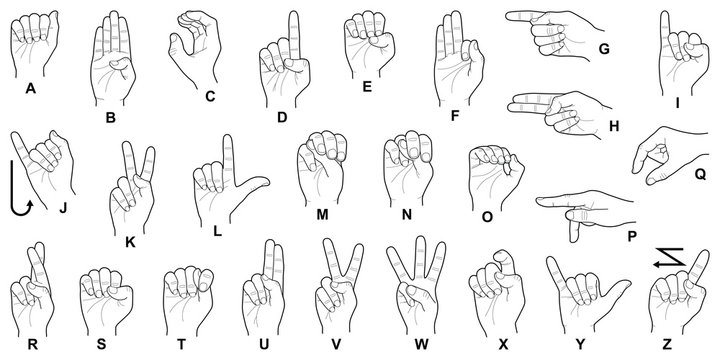

# ASL Spell Out — Real-time Sign Language Letter Recognition

  
*Example signs from the ASL alphabet*

---

## Overview

This project uses a YOLO object detection model to recognize American Sign Language (ASL) letters from a live webcam feed and spells out the detected letters into words in real-time. The system waits for stable hand gestures (detected signs) to finalize each letter and allows building words by sequentially recognizing signs.

## Features

- Real-time ASL letter detection using YOLOv8
- Buffering mechanism to ensure stability before finalizing each letter
- Live display of detected letters and spelled word on the screen
- Option to save snapshots of the current frame with recognized word
- Delete last letter functionality with the `d` key
- Quit and save snapshot with the `q` key

---

## Usage

2. Place your trained YOLO model weights in the project directory (update path in code if needed).

3. Run the Python script:
4. Use your webcam to perform ASL letter signs.

5.Press d to delete the last letter and q to quit and save a snapshot.

